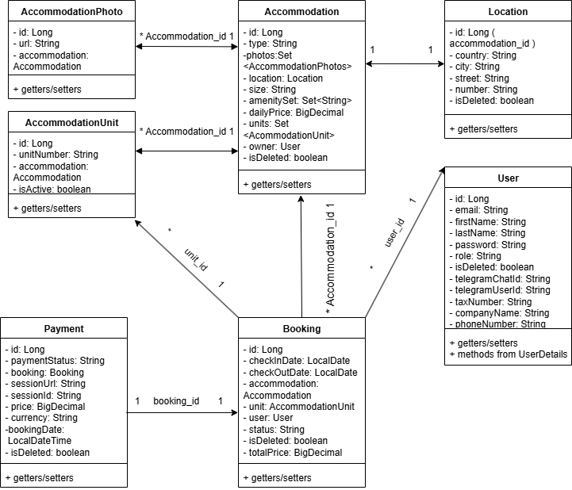

## Accommodation Booking App

A Spring Boot-based RESTful web service for managing and booking accommodations like hotels,
campers, hostels, etc.

## Project goals:

The goal of this project was to create an app which allows businesses or individuals to
offer their accommodations for rent and for users to be able to rent different accommodations with
different amenities, statuses and prices.

## Tech stack:

 - Java 17
 - Spring Boot
 - Spring Security (JWT)
 - Spring Data JPA
 - Hibernate
 - PostgreSQL
 - Swagger/OpenAPI
 - Docker
 - Ngrok
 - Thymeleaf
 - Telegram Bots
 - Maven
 - JUnit + Mockito

## Roles:

 - User: Can register/login, update his details, check and book accommodations, 
  check and make payments for his bookings, receive notification about payments he made in Telegram (optional)
 - Owner: Can create, update and delete his accommodation, get all bookings for his accommodation, 
  receive notification about payments the client made to him in Telegram (optional) + everything the user can do
 - Admin: Can delete/get/update any booking, get payments details for any user and update any User info
  + everything the owner can do

## Main Features:

# Authentication & Authorization
 -Secure user & owner registration
 -JWT-based login system
 -Role-based access control (ADMIN, OWNER, CUSTOMER)

# User Profile Management
 -View and update current user profile
 -Admins can update user roles

# Accommodation Management
 -Admins and Owners can create, update, and delete accommodations
 -All users can browse accommodations with pagination
 -Detailed view of a single accommodation

# Booking Management
 -Customers can create bookings for accommodations
 -Users can view their own bookings
 -Admins and Owners can view and filter bookings by user and status
 -Admins can update booking statuses and delete bookings

# Stripe Payment Integration
 -Initiate payments for bookings
 -Stripe redirect handling for successful and canceled payments
 -Stripe webhook processing for real-time status updates
 -Booking ID is passed via Stripe metadata for tracking
 -User-friendly success, error, and cancel HTML pages

# Payment History
 -Users can view their own payment history
 -Admins can view payments for any user
 -Graceful error handling for payment flow (403, 404, 409, 400)

# Telegram Bot Integration
 -Generate personal deep-link to link a Telegram account
 -Token-based Telegram user identification and linking

## Entity Relationship diagram:

Here is the ERD representing all main entities and relationships in the booking app system:

## Code Quality

This project uses the following tools to maintain clean and consistent code:

 - Checkstyle – to enforce code style rules
 - Maven Compiler Plugin – to ensure compatibility
 - JUnit + Mockito – for unit and integration testing

## Video guide

https://www.loom.com/share/fa146f55dac84344ba83a3b201c6ac5c?sid=c96a8a40-647a-4515-bdf6-28d8a6065a31

## Postman collection:

https://.postman.co/workspace/My-Workspace~1aaecfe4-bf1e-4ea4-82e2-d2c99d18913d/collection/44947335-f8c610ec-d538-4546-8c68-1756c17fc7ca?action=share&creator=44947335

## Swagger link:

http://localhost:8080/swagger-ui/index.html

## Setup

# First, ensure you have the following installed:
- Java Development Kit (JDK)
- Docker and Docker Compose 
- Ngrok.exe (for public endpoints where you redirected after payment)
# Clone the repository (https://github.com/serhii-hl/jv-accommodation-booking-service)
# Create an .env file with the necessary environment variables. (See .env-template and secret-keys-properties for a sample.)
# Repackage the project with mvn clean package command
# Run the following commands to build and start the Docker containers:
- docker-compose build 
- docker-compose up.
# The application should now be running at http://localhost:8080